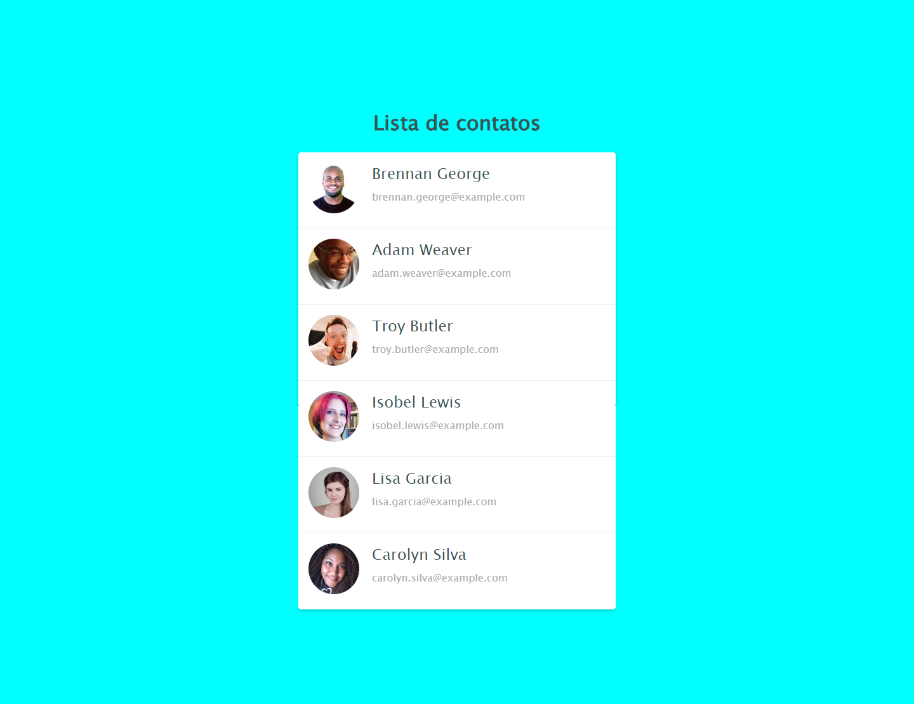

# Projeto Lista de Contatos

Esse projeto é minha solução ao desafio apresentado na seção 6 do curso: Curso Web Frontend Fundamentos HTML5 CSS3 e JS + 10 Projetos. Esse desafio teve como foco a prática na utilização do flexbox para o posicionamento de elementos de caixa.

Imagem do resultado obtido. (Obs. ao utilizar a extensão: GoFullPage. É removido a barra de rolagem lateral da lista que passa exibir todos os itens na imagem gerada)

